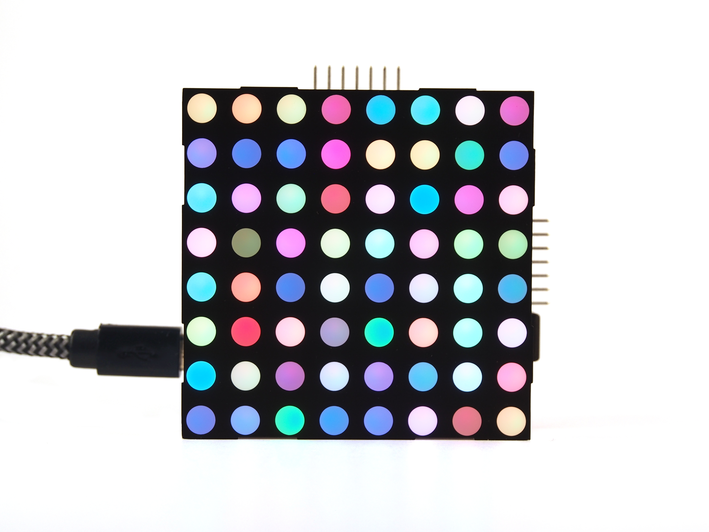
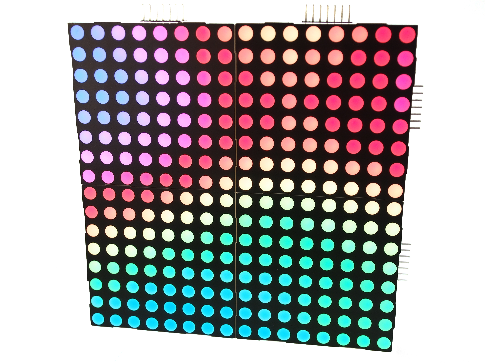
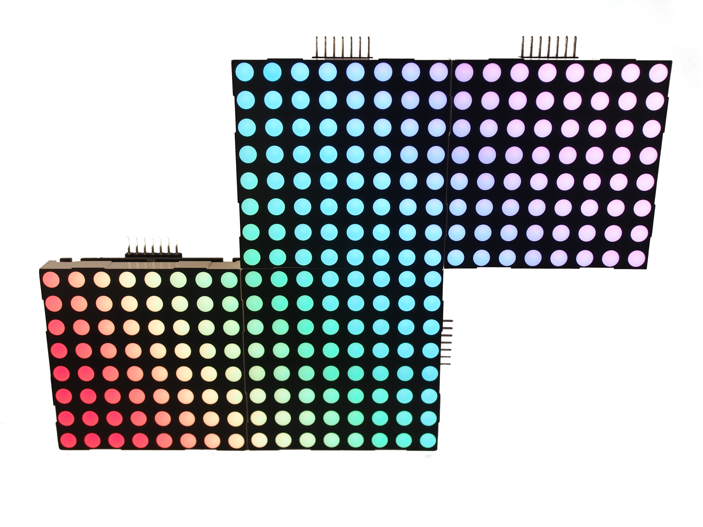

# RGB Matrix

RGB Matrix is a driver board for 8x8 RGB matrix displays.

## Features
* USB: The display is controlled over USB.
* 48-bit: Each RGB channel is 16 bits, meaning true 48-bit color!
* Tileable: Multiple displays can be tiled to form bigger displays.
* CA/CC: Both Common Anode and Common Cathode displays are supported.
* Power options: The display can either be powered by USB or via an external
  power adapter.

## Tiling
Several boards can be tiled together to create larger displays. Frames are
propagated to each board over SPI in a daisy chain configuration.

More exotic configurations are also possible:

## 48-bit color
Each color channel is 16 bits which means true 48-bit color per pixel.
That's more than 281 *trillion* colors!
With such a high color depth, transitions between colors appears seamless,
resulting in beautiful smooth animations.

## Hardware
For details about the hardware, head over to [hardware/README.md](hardware/README.md)

## Firmware
TBD

## Client
TBD
