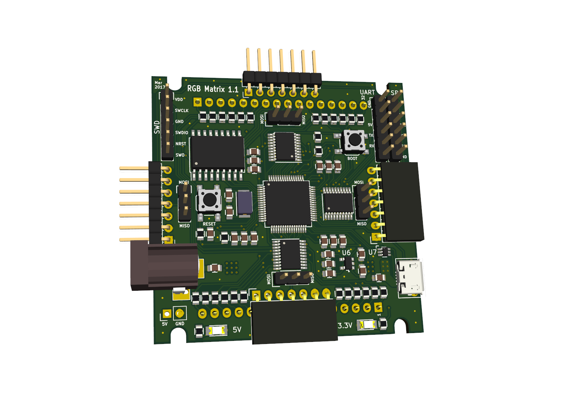

# Hardware
The board is based around an STM32F405 microcontroller which drives each LED
with 16-bit hardware PWM. It also handles USB, SPI, etc.

Each column is driven by SN74AC244 buffers, while the rows are driven by
TBD62783 (common anode) or TBD62083/ULN2803A (common cathode).

## PCB
The PCB is 4 layers and connects with the LED matrix like a backpack.

The PCB was designed to handle currents up to 6A, which typically means max 8
panels in series, with the limiting component being the pin headers.

## BOM
TODO

## Assembly
TODO: Some tips on soldering the board

## Common cathode / common anode
TODO: info on components for CA/CC + jumpers

## Power options
TODO: info about the jumpers

## Tiling
TODO: how to set jumpers

## Supported RGB displays
The board was originally designed for the 8x8 RGB Matrix sold by SparkFun (now
sadly discontinued). Luckily there are plenty of displays on the market which
are pin compatible. Some of them are listed below.

Any display with the same form factor should work, *as long as the rows are on
pins 7-10 and 23-26*. Exactly which rows and columns are where is less
important: they can be easily remapped in firmware.

TODO: picture

If you find a display that looks compatible which is not in the list below,
please let me know so I can add it!

Tested displays:
* [YSM-2388CRGBC](https://www.sparkfun.com/products/retired/683) (common cathode, retired)
* [ARK-SZ912388RGB](https://wxjsinfo.en.alibaba.com/product/1877395129-801004755/8x8_RGB_led_matrix_with_7_62mm_pitch.html) (common anode)

Should work:
* [Betlux BL-M23B881RGB-11](http://shop.evilmadscientist.com/productsmenu/241) (common cathode)
* [LEDM88RGBCC](http://www.futurlec.com/LED/LEDM88RGBCC.shtml) (common cathode)

